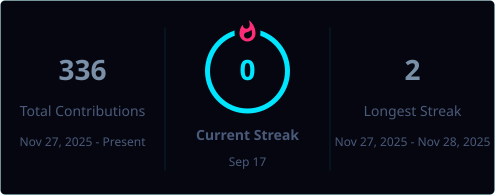

<div align="center">


<h1><font face="Arial">GUILHERME SANTOS</font></h1>
<p><font face="Arial"><b>CYBERSECURITY ANALYST · SOC / BLUE TEAM · NETWORK SECURITY &amp; DATABASES</b></font></p>

<p align="center">
  <a href="https://guilhermesant29.github.io/"></a>&nbsp;
  <a href="https://www.linkedin.com/in/gui-santos05092008/"></a>&nbsp;
  <a href="mailto:contate.guilherme.santos@gmail.com"></a>&nbsp;
  <a href="https://guilhermesant29.github.io/CURRICULO-Guilherme-Santos.pdf"></a>
</p>

</div>

---

## `$ CAT SOBRE.TXT`

```bash
> TÉCNICO EM CIBERSISTEMAS PARA AUTOMAÇÃO — SENAI (GUARULHOS, SP)
> ESPECIALIDADE: NETWORK SECURITY · BLUE TEAM · DATABASES · BACKEND
> STACK DE DEFESA: SOC / TRIAGEM · ANÁLISE DE LOGS · THREAT DETECTION · HARDENING
> STACK TÉCNICA: PYTHON · SQL/MYSQL · LINUX · WINDOWS SERVER · TCP/IP
> IDIOMAS: PT-BR (NATIVO) · EN (B1) · ES (A2)
> STATUS: ABERTO A ESTÁGIO E VAGAS JÚNIOR EM CYBERSECURITY / SOC / BLUE TEAM
```

---

## RESUMO

TÉCNICO EM CIBERSISTEMAS PARA AUTOMAÇÃO (SENAI GUARULHOS), COM FOCO EM **DEFESA**: MONITORAMENTO DE EVENTOS, ANÁLISE DE LOGS, SEGURANÇA DE REDES E HARDENING. COMPLEMENTO A ÁREA DE SEGURANÇA COM UMA BASE SÓLIDA EM **BANCOS DE DADOS E AUTOMAÇÃO EM PYTHON**, O QUE ME PERMITE TRANSFORMAR DADOS BRUTOS DE INFRAESTRUTURA EM DETECÇÃO E RESPOSTA.

ATUALMENTE CONSTRUINDO LABORATÓRIOS PRÓPRIOS DE SOC E ANÁLISE DE TRÁFEGO PARA DOCUMENTAR METODOLOGIA DE TRIAGEM, DETECÇÃO E RESPOSTA A INCIDENTES.

---

## STACK

| ÁREA | TECNOLOGIAS |
| --- | --- |
| **🛡️ CYBER DEFENSE** | SOC / TRIAGEM · ANÁLISE DE LOGS · THREAT DETECTION · INCIDENT RESPONSE · HARDENING · VULNERABILITY MGMT |
| **🌐 NETWORK SECURITY** | TCP/IP · DNS · WIRESHARK · NMAP · TRAFFIC ANALYSIS |
| **🗄️ DATABASES** | MYSQL · SQL · MODELAGEM DE DADOS |
| **⚙️ DEV & AUTOMAÇÃO** | PYTHON · REST APIS · GIT/GITHUB · C# · C++ · CLPS · ESP8266 / IOT |
| **🖥️ INFRA & OS** | LINUX · WINDOWS SERVER · CLOUD FUNDAMENTALS |

---

## PROJETOS

<table align="center">
<tr>
<td width="50%" valign="top">

**🔌 IOT MONITORING SYSTEM**  
MONITORAMENTO COM ESP8266 + API REST + MYSQL + GOOGLE SHEETS.  
`ESP8266` `REST API` `PYTHON` `MYSQL`  
[→ REPOSITÓRIO](https://github.com/GuilhermeSANT29/Projeto-Integrador---IoT)

</td>
<td width="50%" valign="top">

**🏭 INDUSTRIAL MONITORING SYSTEM**  
GESTÃO DE COLABORADORES, MÁQUINAS E SENSORES COM BANCO DE DADOS E AUTOMAÇÃO.  
`PYTHON` `MYSQL` `AUTOMATION`  
[→ REPOSITÓRIO](https://github.com/GuilhermeSANT29/DataBase/tree/main/projeto%20do%20falabella)

</td>
</tr>
<tr>
<td width="50%" valign="top">

**🕵️ SECURITY MONITORING LAB** `EM ANDAMENTO`  
ANÁLISE DE LOGS, TRIAGEM DE EVENTOS E INDICADORES DE SEGURANÇA.  
`SOC` `LOGS` `DETECTION` `BLUE TEAM`

</td>
<td width="50%" valign="top">

**📡 NETWORK SECURITY LAB** `EM ANDAMENTO`  
ANÁLISE DE TRÁFEGO, PROTOCOLOS E DETECÇÃO DE ANOMALIAS EM AMBIENTE CONTROLADO.  
`TCP/IP` `DNS` `TRAFFIC ANALYSIS`

</td>
</tr>
</table>

---

## CERTIFICAÇÕES & ESTUDOS

- TÉCNICO EM CIBERSISTEMAS PARA AUTOMAÇÃO — SENAI 1200H | 2025 - 2026

---

## 📊 GITHUB CONTRIBUTIONS

<div align="center">

<a href="https://github.com/GuilhermeSANT29">
  
</a>

<br><br>


</div>

---

<p align="center">
  
</p>
