<h1>Guilherme Santos</h1>

<b>Cybersecurity Analyst · SOC / Blue Team · Network Security &amp; Databases</b>

Guarulhos, SP · PT-BR nativo · EN B1 · ES A2 · Aberto a estágio e vagas júnior

---

## Sobre

Técnico em Cibersistemas para Automação (SENAI Guarulhos), com foco em **defesa**: monitoramento
de eventos, análise de logs, segurança de redes e hardening. Complemento a área de segurança com
uma base sólida em **bancos de dados e automação em Python**, o que me permite transformar dados
brutos de infraestrutura em detecção e resposta.

Atualmente construindo laboratórios próprios de SOC e análise de tráfego para documentar
metodologia de triagem, detecção e resposta a incidentes.

---

## Stack

| Área | Tecnologias |
| --- | --- |
| **Cyber Defense** | SOC / Triagem · Análise de Logs · Threat Detection · Incident Response · Hardening · Vulnerability Mgmt |
| **Network Security** | TCP/IP · DNS · Wireshark · Nmap · Traffic Analysis |
| **Databases** | MySQL · SQL · Modelagem de dados |
| **Dev & Automação** | Python · REST APIs · Git/GitHub · ESP8266 / IoT |
| **Infra & OS** | Linux · Windows Server · Cloud Fundamentals |

---

## Projetos

<table align="center">
<tr>
<td width="50%" valign="top">

**🔌 IoT Monitoring System**
Monitoramento com ESP8266 + API REST + MySQL + Google Sheets.
`ESP8266` `REST API` `Python` `MySQL`
[→ repositório](https://github.com/GuilhermeSANT29/Projeto-Integrador---IoT)

</td>
<td width="50%" valign="top">

**🏭 Industrial Monitoring System**
Gestão de colaboradores, máquinas e sensores com banco de dados e automação.
`Python` `MySQL` `Automation`
[→ repositório](https://github.com/GuilhermeSANT29/DataBase/tree/main/projeto%20do%20falabella)

</td>
</tr>
<tr>
<td width="50%" valign="top">

**🕵️ Security Monitoring Lab** `EM ANDAMENTO`
Análise de logs, triagem de eventos e indicadores de segurança.
`SOC` `Logs` `Detection` `Blue Team`

</td>
<td width="50%" valign="top">

**📡 Network Security Lab** `EM ANDAMENTO`
Análise de tráfego, protocolos e detecção de anomalias em ambiente controlado.
`TCP/IP` `DNS` `Traffic Analysis`

</td>
</tr>
</table>

## Certificações & Estudos

- Técnico em Cibersistemas para Automação — SENAI *(em curso)*
- *(adicionar: Cisco Networking Academy / Santander Cyber / TryHackMe / Blue Team Level 1, com link de verificação)*

---

---

  

